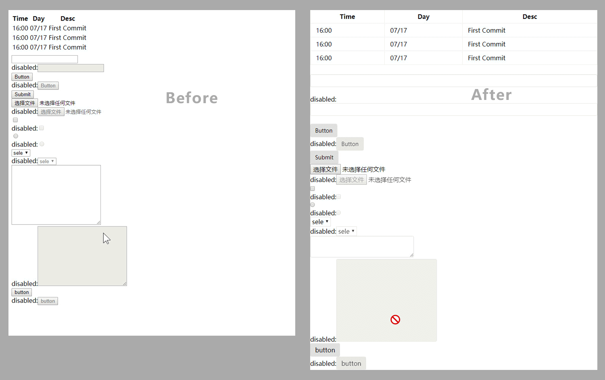

# reset-browser-normalize
RBN - [reset browser normalize]. Unify all browser base styles, of course, there are some custom properties

**Preview**

More ...

**NPM**

```sh
npm install --save rbn.css
```

**Download**
```sh
git clone https://github.com/crlang/reset-browser-normalize/archive/master.zip
```

**LICENSE**
[MIT](./LICENSE)